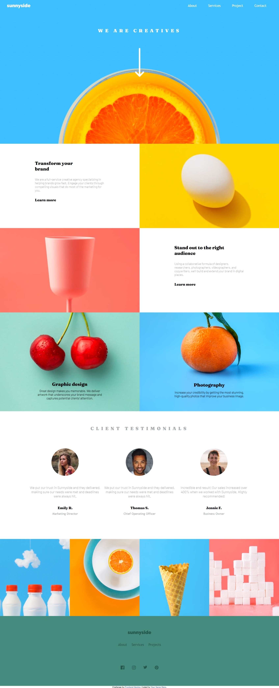

# Frontend Mentor - Sunnyside agency landing page solution

This is a solution to the [Sunnyside agency landing page challenge on Frontend Mentor](https://www.frontendmentor.io/challenges/sunnyside-agency-landing-page-7yVs3B6ef). Frontend Mentor challenges help you improve your coding skills by building realistic projects.

## Table of contents

- [Overview](#overview)
  - [The challenge](#the-challenge)
  - [Screenshot](#screenshot)
  - [Links](#links)
- [My process](#my-process)
  - [Built with](#built-with)
  - [What I learned](#what-i-learned)
  - [Continued development](#continued-development)
  - [Useful resources](#useful-resources)
- [Author](#author)
- [Acknowledgments](#acknowledgments)

## Overview

### The challenge

Users should be able to:

- View the optimal layout for the site depending on their device's screen size
- See hover states for all interactive elements on the page

### Screenshot



### Links

- Solution URL: [Add solution URL here](https://your-solution-url.com)
- Live Site URL: [Add live site URL here](https://your-live-site-url.com)

## My process

### Built with

- Semantic HTML5 markup
- CSS custom properties
- Flexbox
- CSS Grid
- Mobile-first workflow

### What I learned

```html
  <div class="testimonials">
            <div class="container">
              <div class="image-container">
                
              </div>
              <p class="description">
                We put our trust in Sunnyside and they delivered, making sure
                our needs were met and deadlines were always hit.
              </p>

              <p class="title-name">Emily R.</p>
              <p class="title1">Marketing Director</p>
            </div>
            <div class="container1">
              <div class="image-container">
                
              </div>
              <p class="description">
                We put our trust in Sunnyside and they delivered, making sure
                our needs were met and deadlines were always hit.
              </p>

              <p class="title-name">Thomas S.</p>
              <p class="title1">Chief Operating Officer</p>
            </div>

            <div class="container2">
              <div class="image-container">
                
              </div>
              <p class="description">
                Incredible end result! Our sales increased over 400% when we
                worked with Sunnyside. Highly recommended!
              </p>

              <p class="title-name">Jennie F.</p>
              <p class="title1">Business Owner</p>
            </div>
          </div>
        </div>
```

```css
@media only screen and (max-width: 768px) {
  .sixth-section {
    height: calc(70vh - 12.8px);
    grid-template-columns: repeat(2, 1fr);
  }
}
```

## Author

- Website - [Salihu Andulhamid](https://infallible-pike-a0b433.netlify.app/)
- Frontend Mentor - [@Codedzephyr](https://www.frontendmentor.io/profile/Codedzephyr)
- Twitter - [@dimah](https://www.twitter.com/_Dimah__)
